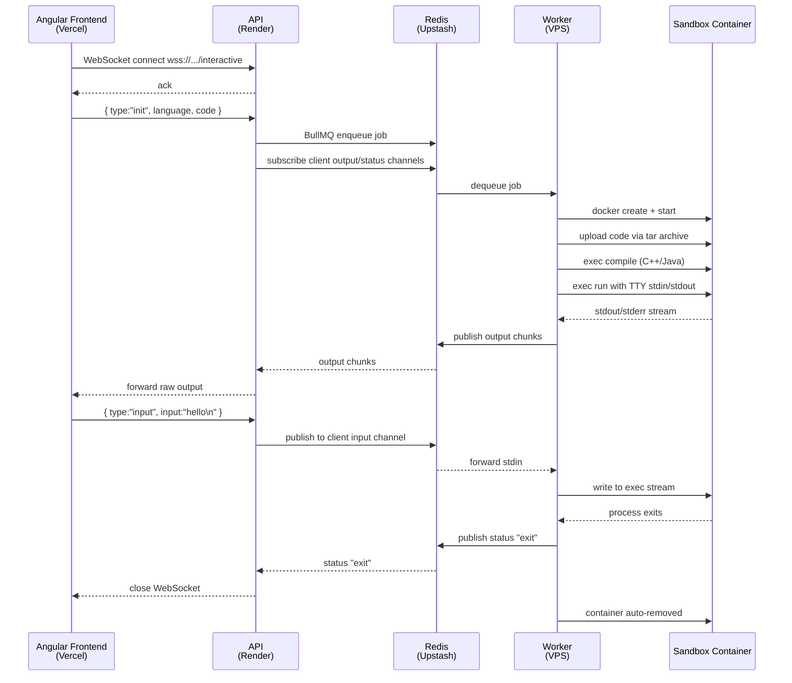

# ⚡ Code Executor

A production-grade **Remote Code Execution** platform that runs user-submitted Python, C++, and Java code inside fully isolated Docker sandboxes. The architecture decouples the APIs, the execution worker, and the frontend into three independently deployable services.

---

## 🏗️ Architecture Overview

```
┌─────────────────────────────────────────────────────────────────────┐
│                          CLIENT BROWSER                             │
│                  Angular SPA (hosted on Vercel)                     │
│          Monaco Editor  ·  xterm-style terminal  ·  Warm UI         │
└────────────────────────────┬────────────────────────────────────────┘
                             │  WebSocket  wss://
                             ▼
┌─────────────────────────────────────────────────────────────────────┐
│                       API (Render)                          │
│               Express · WebSocket · BullMQ Producer                 │
│                                                                     │
│  ws /interactive ──► validate ──► enqueue job ──► subscribe Redis   │
│                                                                     │
│         No Docker socket · No code execution · Stateless            │
└──────────────────────────┬──────────────────────────────────────────┘
                           │  BullMQ Queue  +  Redis Pub/Sub
                           │  (Upstash Redis TLS)
                           ▼
┌─────────────────────────────────────────────────────────────────────┐
│                   EXECUTION WORKER (VPS / Docker)                   │
│                  BullMQ Consumer · Dockerode · Node.js              │
│                                                                     │
│  dequeue job ──► pull image ──► create container ──► exec code      │
│               ──► stream stdout/stderr ──► publish Redis            │
│                                                                     │
│  Mounts: /var/run/docker.sock   (Docker-in-Docker pattern)          │
└──────────────────────────┬──────────────────────────────────────────┘
                           │  spawn / inspect / stop
                           ▼
         ┌─────────────────────────────────────────────┐
         │           SANDBOX CONTAINERS               │
         │  python:3.10-alpine  gcc:12  eclipse-temurin│
         │                                             │
         │  Memory: 128 MB      CPU: 0.5 cores         │
         │  Network: none       PIDs: 30               │
         │  AutoRemove: true    ReadonlyRootfs: false   │
         └─────────────────────────────────────────────┘
```

### Data Flow



---

## 🧱 Tech Stack

| Layer | Technology |
| :--- | :--- |
| **Frontend** | Angular 19, standalone components, CSS variables |
| **API Gateway** | Node.js, Express, `ws` (WebSocket), BullMQ |
| **Worker** | Node.js, BullMQ consumer, Dockerode |
| **Message Broker** | Redis (Upstash) — Queue + Pub/Sub |
| **Sandbox Runtime** | Docker — `python:3.10-alpine`, `gcc:12`, `eclipse-temurin:17-alpine` |
| **Language** | TypeScript (strict mode) |

---

## 📁 Repository Structure

```
code_execution/
├── server/                     # Backend monorepo (API + Worker share one image)
│   ├── src/
│   │   ├── index.ts            # API Gateway entry point
│   │   ├── worker.ts           # BullMQ Worker entry point
│   │   ├── config/
│   │   │   ├── hostConfig.ts   # Docker sandbox resource constraints
│   │   │   └── languages.config.ts  # Language → image/command mapping
│   │   ├── controllers/
│   │   │   └── interactive.socket.ts  # WebSocket handler
│   │   ├── core/
│   │   │   ├── docker.client.ts       # Dockerode initialisation
│   │   │   ├── redis.client.ts        # ioredis + TLS setup
│   │   │   └── sandbox.service.ts     # Container lifecycle management
│   │   ├── services/
│   │   │   └── pubsub.service.ts      # Redis Pub/Sub channels
│   │   └── types/
│   │       └── index.ts
│   ├── Dockerfile                     # Multi-stage build (builder + production)
│   ├── docker-compose.yml             # All-in-one: API + Worker (local dev)
│   ├── docker-compose.gateway.yml     # API Gateway only
│   ├── docker-compose.worker.yml      # Execution Worker only (VPS)
│   └── package.json
│
└── frontend/                   # Angular SPA
    └── src/
        ├── app/
        │   ├── core/services/
        │   │   └── code-execution.service.ts   # WebSocket lifecycle
        │   ├── shared/models/
        │   │   └── execution.models.ts         # Types, LanguageOptions
        │   └── features/executor/
        │       ├── executor.component.*         # Smart coordinator component
        │       └── components/
        │           ├── editor/                 # Dumb: code textarea + lang tabs
        │           └── terminal/               # Dumb: output + stdin input
        └── environments/
            ├── environment.ts                  # dev WS URL
            └── environment.prod.ts             # prod WS URL (Render)
```

---

## 🛡️ Security Sandbox Constraints

Each user-submitted code runs inside a container with the following hard limits enforced by the Docker daemon (not by the code itself):

| Constraint | Value | Purpose |
| :--- | :--- | :--- |
| Memory limit | `128 MB` | Prevents OOM attacks |
| CPU allocation | `0.5 cores` | Prevents CPU exhaustion |
| Network mode | `none` | Blocks all outbound network access |
| PID limit | `30` | Prevents fork-bomb attacks |
| Cap-drop | `ALL` | Drops all Linux capabilities |
| Auto-remove | `true` | Container deleted on exit |

---

## 🚀 Deployment Guide

### Frontend → Vercel

1. Connect your GitHub repo to [Vercel](https://vercel.com/).
2. Set the **Root Directory** to `frontend`.
3. Framework preset: **Angular**.
4. Set the environment variable `NG_APP_WS_URL` or update `environment.prod.ts` with your Render URL before deploying:
   ```
   wss://your-render-service.onrender.com/interactive
   ```

### API Gateway → Render

1. Create a new **Web Service** on [Render](https://render.com/).
2. Set **Root Directory** to `server`.
3. Runtime: **Docker** (Render builds using `server/Dockerfile`, default `CMD` runs the API).
4. Add environment variables:

   | Variable | Value |
   | :--- | :--- |
   | `NODE_ENV` | `production` |
   | `PORT` | `3000` |
   | `REDIS_HOST` | `<your-upstash-endpoint>` |
   | `REDIS_PORT` | `6379` |
   | `REDIS_PASSWORD` | `<your-upstash-password>` |

### Execution Worker → VPS

The Worker **must run on a VPS** (AWS EC2, DigitalOcean, Hetzner, etc.) with a Docker daemon, because it mounts `/var/run/docker.sock` to spawn sandbox containers.

```bash
# 1. Install Docker
curl -fsSL https://get.docker.com | sudo sh

# 2. Pre-pull sandbox language images (avoids cold-start timeouts)
sudo docker pull python:3.10-alpine
sudo docker pull gcc:12
sudo docker pull eclipse-temurin:17-alpine

# 3. Clone the repo
git clone https://github.com/aryanrathod1511/code_execution.git
cd code_execution/server

# 4. Create .env file
cat > .env <<EOF
NODE_ENV=production
REDIS_HOST=your-upstash-endpoint.upstash.io
REDIS_PORT=6379
REDIS_PASSWORD=your-upstash-password
CONCURRENCY=4
EOF

# 5. Start the worker
sudo docker compose -f docker-compose.worker.yml up -d

# 6. View logs
sudo docker compose -f docker-compose.worker.yml logs -f
```

> **Note:** No inbound ports need to be opened on the VPS. The worker only makes outbound connections to Redis. Close all inbound traffic except SSH (port 22).

---

## 💻 Local Development

### Prerequisites
- Node.js v22+
- Docker Desktop (running)
- A Redis instance (local Docker or Upstash free tier)

### Start a local Redis
```bash
docker run -d --name local-redis -p 6379:6379 redis:alpine
```

### Run the API Gateway
```bash
cd server
npm install
npm run dev
# Server starts on http://localhost:3000
```

### Run the Worker
```bash
cd server
npm run worker:dev
```

### Run the Frontend
```bash
cd frontend
npm install
npm start
# App starts on http://localhost:4200
```

---

## 📜 License

MIT — see [LICENSE](LICENSE) for details.
